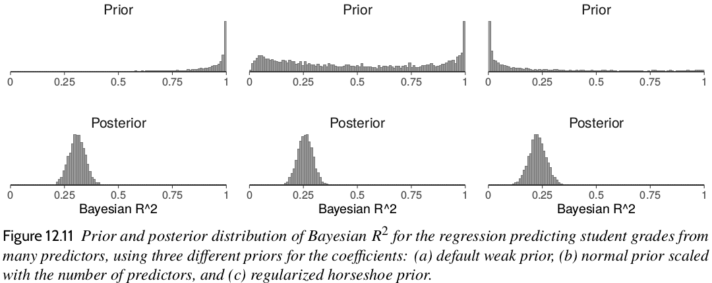

-------------

Errata (excluding minor typos) for the book.

If you notice an error that is not mentioned in the errata below, submit an issue at https://github.com/avehtari/ROS-Examples/issues or send an email.

## 1st and 2nd printing

- p. 146, $\mbox{RSS} = \sum_{i=1}^n(y_i - X\hat{\beta})^2$ should be $\mbox{RSS} = \sum_{i=1}^n(y_i - X_i\hat{\beta})^2$ (thanks to Ravi Shroff)
- p. 150, ex 10.2b "for the treatment group and the control group," $\rightarrow$ "for the treatment group," (thanks to Jakob Staudt)
- p. 167, the code line `y_rep[s,1] <- y[1]` should be `y_rep[s,1] <- unemp$y[1]` (thanks to Ravi Shroff)
- p. 181, ex 11.5(b) "Figure 10.2." should be "Figure 11.2." (thanks to Ravi Shroff)
- p. 187, "a procedure that is equivalent to centering and rescaling is to leave" $\rightarrow$ "we can get the same inferences for the coefficients other than the intercept by leaving" (thanks to Ravi Shroff)
- p. 209, "$\frac{p_0}{D-p_0}\frac{\sigma}{\sqrt{n}}$, where $p_0$ is the expected number of relevant predictors" $\rightarrow$ "$\frac{p_0}{p-p_0}\frac{\sigma}{\sqrt{n}}$, where $p$ is the number of predictors, $p_0$ is the expected number of relevant predictors" (thanks to Roberto Viviani)
- p. 231, $\log(-.595)$ $\rightarrow$ $\log(0.595)$ (thanks to Daniel Timar)
- p. 267 `fit_nb[[k]] <- stan_glm(y ~ x, family=neg_binomial_2(link="log"), data=fake, refresh=0)` $\rightarrow$ `fit_nb[[k]] <- stan_glm(y ~ x, family=neg_binomial_2(link="log"), data=fake_nb[[k]], refresh=0)` (thanks to Brian Bucher)
- p. 268, `offset=log(exposure)` $\rightarrow$ `offset=log(exposure2)` (thanks to A. Solomon Kurz)
- p. 269, `y_rep_1 <- posterior_predict(fit_1)` $\rightarrow$ `yrep_1 <- posterior_predict(fit_1)` (thanks to Darci Kovacs)
- p. 285, The numbers for the earnings model on p.285 should be the same as on p. 284 (thanks to David Galley)
- p. 295, $n=(2.8* 0.49/0.1)^2=196$ $\rightarrow$ $n=(2.8* 0.5/0.1)^2=196$, where $0.5$ is used as a conservative estimate of the standard deviation (thanks to Solomon A. Kurz)
- p. 299, $0.5/1.15 = 0.43$ $\rightarrow$ $0.5/1.25 = 0.4$ (thanks to Solomon A. Kurz)
- p. 300, The paragraph starting "We illustrate with the example of the survey earnings and height discussed in Chapter 4." and the next two paragraphs have been edited to:\
&nbsp;&nbsp;&nbsp;We illustrate with the survey of earnings and height discussed in Chapter 12.  The coefficient for the sex-earnings interaction in model (12.2) is plausible (a positive interaction, implying that an extra inch of height is worth 2\% more for men than for women), with a standard error of 1\%.\
&nbsp;&nbsp;&nbsp;Extracting another significant figure from the fitted regression yields an estimated interaction of 0.018 with  standard error 0.015.  How large a sample size would have been needed for the coefficient on the interaction to be "statistically significant" at the conventional 95\% level?  A simple calculation uses the fact that standard errors are proportional to $1/\sqrt{n}$.  For a point estimate of 0.018 to be two standard errors from zero, it would need a standard error of 0.009, which would require the sample size to be increased by a factor of $(0.015/0.009)^2$.  The original survey had a sample of 1629; this implies a required sample size of $1629*(0.015/0.009)^2=4500$.\
&nbsp;&nbsp;&nbsp;To perform a power calculation for this hypothetical larger survey of 4500 people,  we could suppose that the true
$\beta$ for the interaction is equal to 0.018 and that the standard
error is as we have just calculated.  With a standard error of 0.009
the estimate from the regression would then be conventionally "statistically
significant" only if $\hat{\beta}>0.018$ (or, in other direction, if
$\hat{\beta}< -0.018$, but that latter possibility is highly unlikely
given our assumptions).  If the true coefficient $\beta$ is 0.018, then we would expect $\hat{\beta}$ to
exceed 0.018, and thus achieve statistical significance, with a
probability of $\frac{1}{2}$---that is, 50\% power.  To get 80\% power, we need
the true $\beta$ to be 2.8 standard errors from zero, so that there is
an 80\% probability that $\hat{\beta}$ is at least 2 standard errors
from zero.  If $\beta=0.018\%$, then its standard error would have to be
no greater than $0.018/2.8$, so that the survey would need a sample
size of $1629*(2.8*0.015/0.018)^2=9000$. (thanks to comment by Solomon A. Kurz, and typo fix by Patrick Wen)
- p. 304 "only 44% of their children were girls" $\rightarrow$ "only 48% of their children were girls" (thanks to comment by Solomon A. Kurz)
- p. 375, three regression equations (unnumbered, 19.2 and 19.3) are missing $\alpha  + $ from the beginning of RHS (right after $=$). (thanks to Junhui Yang)
- p. 407, $\sum_{k=1}^K(X_{ik}-X_{jk})^2$ $\rightarrow$ $(\sum_{k=1}^K(X_{ik}-X_{jk})^2)^{1/2}$ (thanks to Stefan Gehrig)
- p. 324, "90% of African Americans" $\rightarrow$ "88% of African Americans" (thanks to Solomon A. Kurz)

## 1st printing (original printing)

- p. 11, the summary of the treatment-control comparison says "the treated units were 4.8 points higher than the controls, $\bar{y} = 31.7$ under the treatment and $\bar{y} = 25.5$ for the controls." The difference in shown means is 6.2 and not 4.8.  Not that these values change when rerunning the simulation. (thanks Desislava Petkova)
- p. 15, "multiplicative factor; see Exercise 3.8." $\rightarrow$ "multiplicative factor; see Exercise 4.8." (thanks to Omri Har-Shemesh and Juliette Unwin)
- p. 39, in the second sentence of the first full paragraph, "Figure 3.4 displays data on log metabolic rate vs. body mass indicating..." $\rightarrow$ "log metabolic rate vs. log body mass" (thanks Ravi Shroff)
- p. 39, "The slope of the line is then 7.4/10 = 7.4." $\rightarrow$ "The slope of the line is then 7.4/10 = 0.74." (thanks to Jacob Warren)
- p. 42, the last line, in "Linear transformations" section "Exercise 3.5" $\rightarrow$ "Exercise 3.6". (thanks Ed Berry)
- p. 43, "$\sigma_a,\sigma_b$" $\rightarrow$ $\sigma_u,\sigma_v$ (thanks to Braden Scherting)
- p. 46,  "exactly 10 000 votes" $\rightarrow$ "exactly 100 000 votes" (thanks to Gal Matijevic)
- p. 54, in "Comparisons, visual and numerical" subsection, "Figure 4.2" in the first sentence should be "Figure 4.3." (thanks Ravi Shroff)
- p. 55, `se_weighted_avg <- sqrt(sum(W*se)^2)` $\rightarrow$ `se_weighted_avg <- sqrt(sum((W*se)^2))` (thanks to Desislava Petkova)
- p. 57, last line: `n_C+n_T, 2` $\rightarrow$ `n_C+n_T-2` (thanks Justin Reppert)
- p. 61, "$T(y;\phi(y))$, for $j = 1,\dots, J$" $\rightarrow$ "$T(y;\phi_j(y))$, for $j = 1,\dots, J$" (thanks to Kenneth Tay)
- p. 73, `1.483*median(abs(y - median(z)))` $\rightarrow$ 1.483*median(abs(z - median(z)))
- p. 73, `quantile(z, 0.25, 0.75)` $\rightarrow$ quantile(z, c(0.25, 0.75)) and `quantile(z, 0.025, 0.975)` $\rightarrow$ quantile(z, c(0.025, 0.975)) (thanks to Justin Reppert)
- p. 83, Fig 6.1 "y = 0.49 + 0.27 * x" $\rightarrow$ "y = 0.4 + 0.27 * x"
- p. 83, Fig 6.2 Estimate for $\sigma$ should be 0.49 (not 0.43)
- p. 84, "which returns the value R^2 = 0.10, meaning that the linear model accounts for only 9% of the variance". The "9%" should be "10%".
- p. 105, just before Maximum likelihood section "see Exercise 7.1" $\rightarrow$ "see Exercise 8.1" (thanks to Jacob Warren)
- p. 116, the correct code should have `y_linpred <- a + b*as.numeric(new)` and `y_pred <- a + b*as.numeric(new) + rnorm(n_sims, 0, sigma)` (thanks to Nathan Hoffmann)
- p. 128, "Do Exercise 3.8" $\rightarrow$ "Do Exercise 4.8" (thanks to Omri Har-Shemesh and Juliette Unwin)
- p. 131, "the average or expected difference in outcome $y_k$" $\rightarrow$ "... $y$" (thanks to Yoav Kessler)
- p. 143, the correct values for mean and sd in the last column of Figure 10.7 are 260.1 and 2.5 (thanks to Eam O'Brien)
- p. 143, 3rd line from bottom the correct values for mean and sd mentioned in the text are 260.1 and 2.5 (thanks to Eam O'Brien)
- p. 159, "as in Figure 11.2" $\rightarrow$ "as in Figure 11.3" (thanks to Eam O'Brien)
- p. 170, "Even though $R^2$ is much lower in Figure 11.16a, the model fits the data just as well as in Figure 11.16b." $\rightarrow$ "Even though $R^2$ is much lower in Figure 11.16b, the model fits the data just as well as in Figure 11.16a."
- p. 174, "and so the log score is  $-\frac{1}{2}\log\sigma$" $\rightarrow$ "and so the log score is  $-\log\sigma$" (thanks to Matěj Grabovsky)
- p. 179, `fit_2 <- update(fit_2, prior=hs())` $\rightarrow$ `fit_2 <- update(fit_1, prior=hs())` (thanks to Omri Har-Shemesh)
- p. 183,  $\$1600* 3.8=\$63* 97=\$101\,000\,000* 0.000\,060=\$610$ $\rightarrow$  $\$1600* 3.8=\$63* 97=\$101\,000\,000* 0.000\,060=\$6100$ (thanks to Ravi Shroff)
- p. 190 "an expected positive difference of about 5% in the outcome variable" $\rightarrow$ "an expected positive difference of about 6% in the outcome variable"
- p. 208, `/sqrt(0.3*26)` $\rightarrow$ `*sqrt(0.3/26)` (this is correct in the code in the web page, typo fix in the book thanks to Eugenia Migliavacca)
- p. 208, Figure 12.11 all top row subplots show the prior distribution for the regularized horseshoe prior. The correct subplot are produced by the R code in [Student example](https://avehtari.github.io/ROS-Examples/Student/student.html) and shown below (thanks to Zhengchen Cai for reporting the issue)
 { width=800 }

- p. 213, Ex 12.11, "$\beta$ is 0.3" $\rightarrow$ $\beta$ is $-0.3$ (thanks t o Justin Gross)
- p. 217, First line in section 13.1 "The logistic function, logit(x)" $\rightarrow$ "The logit function, logit(x)" (thanks to VicentModesto)
- p. 219, "The inverse logistic function is curved" $\rightarrow$ "The inverse logit function is curved" (thanks to VicentModesto)
- p. 241-242, in paragraphs starting "The steps go..." and "Figure 14.2...": $(4.0/4.1)x_1$ $\rightarrow$ $(4.4/4.1)x_1$ (thanks to Doug Davidson)
- p. 288, Chapter 15 Bibliographic note is missing the reference to the RiskyBehavior data: "The HIV risk data (RiskyBehavior) used in exercises comes fromcomes from El-Bassel et al (2003)." Full reference: El-Bassel, N., Witte, S. S., Gilbert, L., Wu, E., Chang, M., Hill, J., and Steinglass, P. (2003). The efficacy of a relationship-based HIV/STD prevention program for heterosexual couples. *American Journal of Public Health*, **93**, 963–969.
- p. 314, Following Equation (17.1) "... did not include enough Republicans." $\rightarrow$ "... included too many Democrats." (thanks to Mark Fisher)
- p. 316, Figure 17.2 the values in the column $N_j/N$ should be $0.16, 0.17, 0.19, 0.17, 0.16, 0.15$ as in the code on the same page. (thanks to Noah Silbert)
- p. 344, "...Figure 18.1 yields a naive estimated treatment effect of -12.5." $\rightarrow$ "...Figure 18.1 yields a naive estimated treatment effect of +12.5." (thanks to Michael McLaren)
- p. 345, "difference in means, $155-147.5$" $\rightarrow$ "difference in means, $147.5 - 155$" (thanks to Michael McLaren)
- p. 345, at the bottom "More to the point, the $y_i^0$'s are 140, 140, 150, and 170 in the *control* group and 150, 160, 160, and 170 in the *treatment* group." $\rightarrow$ "More to the point, the $y_i^0$'s are 140, 140, 150, and 170 in the *treatment* group and 
150, 160, 160, and 170 in the *control* group." (thanks to Ravi Shroff)
- p. 349 "data presented in Figure 18.4" should be "data presented in Figure 18.3"
- p. 371, "in Figure 19.4a" $\rightarrow$ "in Figure 19.4b" (thanks to Kenneth Tay)
- p. 385, equation number (20.1) should be for the second equation on the page $y_i = \beta^*_0 + \beta^*_1z_i + \epsilon^*_i$ (thanks to Matěj Grabovsky)
- p. 397, last line, in the standard error equation 1738 $\rightarrow$ 1820, 789 $\rightarrow$ 837, and 1.01 $\rightarrow$ 1.04 (thanks to Matěj Grabovsky)
- p. 435, equation 21.7: "$\beta_2 *\mbox{math pre-test}_i$" $\rightarrow$ "$\beta_3 *\mbox{math pre-test}_i$" (thanks to Zhengchen Cai)
- p. 447, "populations homogeneous in $w_i$" $\rightarrow$ "populations homogeneous in $x_i$" (thanks to Kenneth Tay)

-------------
