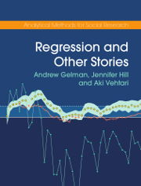

-------------

## Information

 { width=160 }

Home page for the book Regression and Other Stories by [Andrew Gelman](http://www.stat.columbia.edu/~gelman/), [Jennifer Hill](https://steinhardt.nyu.edu/people/jennifer-hill), and [Aki Vehtari](https://users.aalto.fi/~ave/), including [the code and data for the examples](examples.html).

Published by Cambridge University Press in 2020.  © Copyright by Andrew Gelman, Jennifer Hill, and Aki Vehtari 2020.

Back cover text: *Many textbooks on regression focus on theory and
the simplest of examples. Real statistical problems, however, are
complex and subtle. This is not a book about the theory of
regression. It is a book about how to use regression to solve real
problems of comparison, estimation, prediction, and causal
inference. It focuses on practical issues such as sample size and
missing data and a wide range of goals and techniques. It jumps
right in to methods and computer code you can use fresh out of the
box.*

- [Buy Regression and Other Stories from Cambridge University Press](https://doi.org/10.1017/9781139161879)

- [Podcast: a special episode of Learning Bayesian Statistics featuring the ROS authors](https://www.learnbayesstats.com/episode/20-regression-and-other-stories-with-andrew-gelman-jennifer-hill-aki-vehtari)
  
- [Sample exams](https://github.com/avehtari/ROS-Examples/tree/master/Exams/)
- See also an article [Teaching Bayes to Graduate Students in Political Science, Sociology, Public Health, Education, Economics, ...](http://www.stat.columbia.edu/~gelman/research/published/teachingbayes.pdf)

- [ROS online PDF](https://users.aalto.fi/~ave/ROS.pdf). This PDF is free to view and download for personal use only. Not for re-distribution, re-sale or use in derivative works.  With permission from Cambridge University Press. The linked version has corrections up to the date mentioned on the front page. It is best to link to and download from this site [https://avehtari.github.io/ROS-Examples/](https://avehtari.github.io/ROS-Examples/), so that you and others will get the latest corrections and see the extra online material.

- If you notice an error that is not mentioned in [the errata](errata.html), [submit an issue](https://github.com/avehtari/ROS-Examples/issues) or send an email.

## Contents

1. Introduction
2. Data and measurement
3. Some basic methods in mathematics and probability
4. Generative models and statistical inference
5. Simulation
6. Background on regression modeling
7. Linear regression with a single predictor
8. Fitting regression models
9. Prediction and Bayesian inference 
10. Linear regression with multiple predictors
11. Assumptions, diagnostics, and model evaluation
12. Transformations
13. Logistic regression
14. Working with logistic regression
15. Other generalized linear models
16. Design and sample size decisions
17. Poststratification and missing-data imputation
18. Causal inference basics and randomized experiments
19. Causal inference using regression on the treatment variable
21. More advanced topics in causal inference
22. Advanced regression and multilevel models

-------------

## Reviews

- *'Gelman, Hill and Vehtari provide an introductory regression book that hits an amazing trifecta: it motivates regression using real data examples, provides the necessary (but not superfluous) theory, and gives readers tools to implement these methods in their own work. The scope is ambitious - including introductions to causal inference and measurement - and the result is a book that I not only look forward to teaching from, but also keeping around as a reference for my own work.'* Elizabeth Tipton, Northwestern University

- *'Regression and Other Stories is simply the best introduction to applied statistics out there. Filled with compelling real-world examples, intuitive explanations, and practical advice, the authors offer a delightfully modern perspective on the subject. It's an essential resource for students and practitioners across the statistical and social sciences.'* Sharad Goel, Department of Management Science and Engineering, Stanford University

- *'With modern software it is very easy to fit complex regression models, and even easier to get their interpretation completely wrong. This wonderful book, summarising the authors' years of experience, stays away from mathematical proofs, and instead focuses on the insights to be gained by careful plotting and modelling of data. In particular the chapters on causal modelling, and the challenges of working with selected samples, provide some desperately needed lessons.'* David Spiegelhalter, University of Cambridge

- *'Gelman and Hill, have done it again, this time with Aki Vehtari. They have written a textbook that should be on every applied quantitative researcher's bookshelf. Most importantly they explain how to do and interpret regression with real world, complicated examples. Practicing academics in addition to students will benefit from giving this book a close read.'* Christopher Winship, Harvard University, Massachusetts

- *'Overall this is a very modern, stats centred, engaging and careful book on the most common tool of statistical modelling!'* Christian P. Robert, Ceremade - Université Paris-Dauphine. The full review in a blog post [[The Art of] Regression and other stories](https://xianblog.wordpress.com/2020/07/23/the-art-of-regression-and-other-stories/).

-------------
